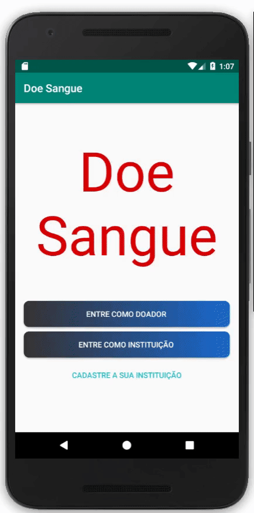

# App de Doação de Sangue

Aplicativo de doação de sangue desenvolvido em java para android

## Participantes

* João Ricardo Minoru Nagasava
* Luiz Gustavo Sincaruk Vieira
* Maurilio da Motta Meireles
* Victor Prado de Carlo

## Aplicativo 

Foi desenvolvido um aplicativo para android que auxilia doadores de sangue (mostra instituições próximas, histórico de doações, registrar tipo sanguíneo...)
e instituições (editar informações, notificar doadores, controlar estoque de sangue ...). Para mais detalhes das funcionalidades, [clique aqui](https://github.com/JNagasava/App_Doacao_de_Sangue/blob/master/relatorio.pdf)

### Doador
 

### Instituição

## Desenvolvimento

Para desenvolver o aplicativo, foi utilizado o *Android Studio* e o *Firebase* para o gerencimaneto dos usuários. A aplicação foi
feita para Android e a linguagem utilizada para o desenvolvimento foi *Java*, visto que este foi o projeto final da disciplina 
Programação Orientada a Objetos.

## Fontes e Ferramentas

[Firebase](https://firebase.google.com/?hl=pt-br)

[Android Studio](https://developer.android.com/studio)

[Java](https://www.java.com/pt_BR/download/)
